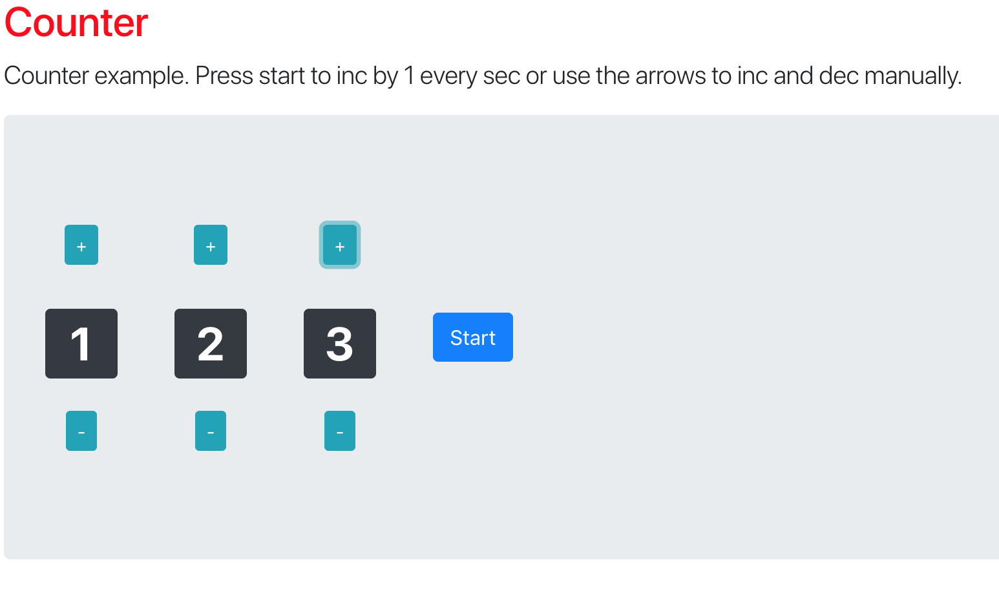
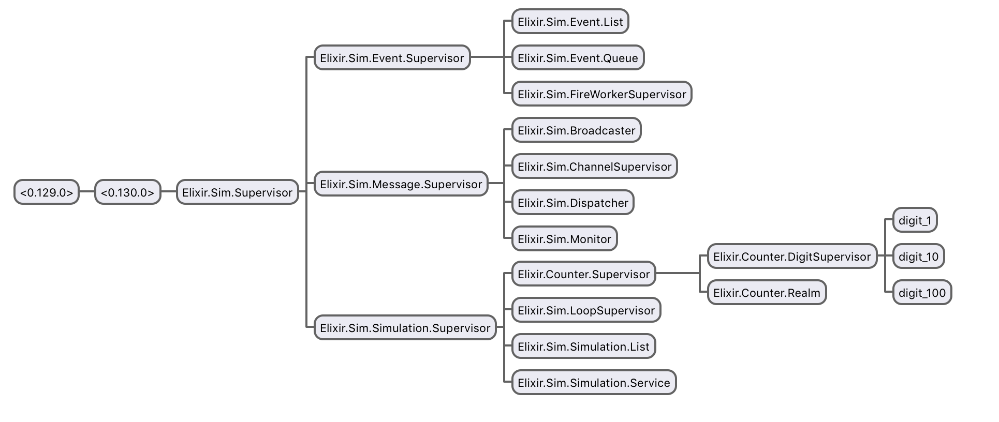

### Tech Talk 29. Nov

# OTP Open Telecom Platform

### Ericsson - Erlang - Elixir


## Process Oriented Programming

- functional, concurrent
- since 1986
- robust, battle proofed
- update code on runtime

### Process

light weight processes

```
pid = spawn(fn -> 1 + 2 end)
```

```
send(pid, {:hello, "world"})
```

```
receive do
  {:hello, msg} -> msg
end
```

### Linking

```
pid = spawn(fn -> raise "upps!" end)
```

```
pid = spawn_link(fn -> raise "upps!" end)
```

```
ref = Process.monitor(pid)
```

## Some Important OTP Modules

- GenServer
- Agent
- Task
- Supervisor
- Application

### Demo




### GenServer

- client - server process
- holds state
- different callbacks

https://hexdocs.pm/elixir/GenServer.html

### Agent

- Agents are simple wrappers around state

https://hexdocs.pm/elixir/Agent.html

### Task

- Conveniences for spawning and awaiting tasks
- async and await
- fire and forget

https://hexdocs.pm/elixir/Task.html

### Supervisor

- a process which supervises other processes
- restart: :permanent, :temporary, :transient
- strategy: one_for_one, rest_for_one, one_for_all

https://hexdocs.pm/elixir/Supervisor.html

### Application

https://hexdocs.pm/elixir/Application.html
